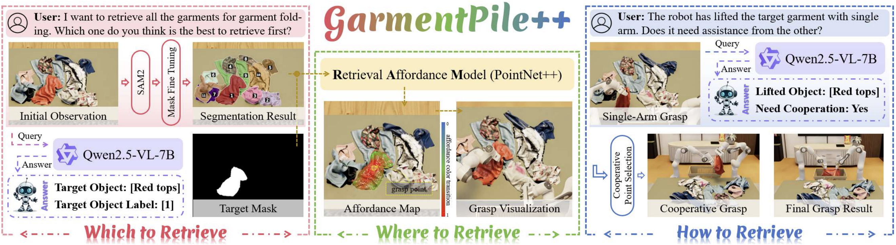

<h2 align="center">
  <b><tt>GarmentPile++</tt>: <br>
  Affordance-Driven Cluttered Garments Retrieval with Vision-Language Reasoning</b>
</h2>

<div align="center" margin-bottom="6em">
<b>ICRA 2026</b>
</div>

<br>

<div align="center">
    <a href="TBD" target="_blank">
    </a>
    <a href="https://garmentpile2.github.io/" target="_blank">
    </a>
    <a href="https://github.com/d-finite/GarmentPile2" target="_blank">
    </a>
</div>

<br>



## Get Started

### 1. Install Isaac Sim 4.5.0
   This project is developed on Isaac Sim 4.5.0. Please refer to the [official guideline](https://docs.isaacsim.omniverse.nvidia.com/4.5.0/installation/download.html) to download Isaac Sim 4.5.0.

   The Python environment for this project is based on the standalone Python environment bundled with Isaac Sim 4.5.0.

### 2. Repo Preparation

First, clone the repo.
```bash
git clone https://github.com/d-finite/GarmentPile2.git
cd GarmentPile2
```

Then, download the *Garment* assets and move them to `Assets/Garment`.

We use GarmentLab's *Garment* assets. Please download the `Garment` folder from the following link: [Google_Drive_link](https://drive.google.com/drive/folders/1EWH9zYQfBa96Z4JyimvUSBYOyW615JSg).

### 3. Environment Preparation

First, add the following alias to your `.bashrc` or `.zshrc` to simplify access to Isaac Sim's Python environment:
```bash
alias isaac45="~/isaacsim-4.5.0/python.sh"
```

Then install the packages listed in `requirements.txt`. If you plan to run training, install PyTorch as well.
```bash
isaac45 -m pip install -r requirements.txt
# if need training
isaac45 -m pip install torch==2.7.0 torchvision==0.22.0 torchaudio==2.7.0 --index-url https://download.pytorch.org/whl/cu128
```

Finally, we require a specific verison of `sam2`.
```bash
git clone https://github.com/facebookresearch/sam2.git && cd sam2
git checkout 2b90b9f
isaac45 -m pip install -e .
```

### 4. Repository Structure Overview

    📂 ProjectRoot
    ├── 📁 Assets  # Assets used in Isaac Sim
    ├── 📁 Env_Config  # Configuration of Env (Camera, Robot, Garment .. ) and Qwen 
    ├── 📁 Env_Data_Collection  # Used for training data collection
    ├── 📁 Env_Eval  # Standalone environment with pre-trained model
    ├── 📁 Model_Train  # Code for model training
    ├── 📁 Repo_Image  # Images used in README.md

## StandAlone Env

Under `Env_Eval/` we provide example scripts for sequentially retrieving all garments in two scenarios: Open Boundary and Closed Boundary. Run the commands below to view the full retrieval pipeline.

**[ATTENTION!]**
**If you find failure of assets loading in simulation, please enter `Env_Config/Config/xx_config.py` to check assets loading path.**

```bash
isaac45 Env_Eval/open_scene.py
isaac45 Env_Eval/closed_scene.py
```

## Data Collection

Under `Env_Data_Collection` we provide example scripts to collect point-cloud training data for both scenarios. Collected data will be saved to `Model_Train/Data/xx_scene`.

The example scripts terminate after collecting data for **3** episodes. If continuous data collection is required, re-run the scripts repeatedly (for example via a bash loop or script).

```bash
isaac45 Env_Data_Collection/open_scene.py
isaac45 Env_Data_Collection/closed_scene.py
```

## Model Training

After data collection, split the data into `train` and `val` and place them under `Model_Train/Data/xx_scene/train` and `Model_Train/Data/xx_scene/val` respectively. Then run the training commands below to start training. Checkpoints will be saved to `Model_Train/Model_Checkpoints/xx_scene`.

```bash
isaac45 Model_Train/open_scene_aff_train.py
isaac45 Model_Train/closed_scene_aff_train.py
```

## Citation and Reference

If you find this paper useful, please consider starring 🌟 this repo and citing 📑 our paper:

```
TBD
```